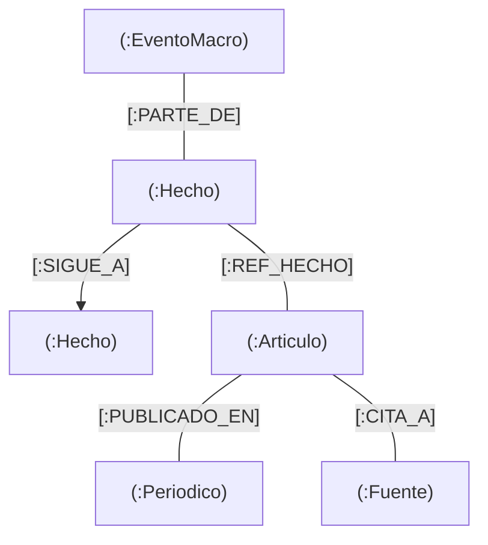

# Especificación Técnica: Grafo de Conocimiento Narrativo

Este documento detalla la estructura del grafo jerárquico de eventos y cómo consultarlo desde el frontend para construir visualizaciones (líneas de tiempo, agrupaciones, etc.).

## 1. Esquema del Grafo (Jerarquía)

El grafo distingue entre procesos de larga duración (**EventoMacro**) y sucesos puntuales (**Hecho**), permitiendo una navegación desde lo general a lo específico.



### Nodos y Propiedades Clase

| Nodo | Propiedad | Descripción |
| :--- | :--- | :--- |
| **EventoMacro** | `nombre` | Título del proceso (ej: "Ofensiva sobre Gaza"). |
| | `descripcion` | Resumen del contexto general. |
| **Hecho** | `nombre` | Resumen corto del suceso (ID único legible). |
| | `fecha` | Fecha ISO (YYYY-MM-DD). **Clave para la línea de tiempo**. |
| | `descripcion` | Detalle del suceso extraído por el LLM. |
| **Articulo** | `titulo` | Titular del periódico. |
| | `url` | Enlace directo a la noticia (ID del nodo). |

---

## 2. Consultas Cypher para el Frontend

### A. Obtener Línea de Tiempo de Hechos
Retorna todos los hechos de un Macro-Evento ordenados por fecha, ideal para pintar la línea base del visual.

```cypher
MATCH (m:EventoMacro {nombre: "Nombre del Evento"})<-[:PARTE_DE]-(h:Hecho)
RETURN h.nombre as id, h.fecha as date, h.descripcion as text
ORDER BY h.fecha ASC
```

### B. Obtener Artículos por Hecho (Mapping El País / El Mundo)
Dado un hecho específico (al pinchar en la línea de tiempo), esta consulta trae las noticias relacionadas de cada medio.

```cypher
MATCH (h:Hecho {nombre: $hecho_id})<-[:REF_HECHO]-(a:Articulo)-[:PUBLICADO_EN]->(p:Periodico)
RETURN p.nombre as medio, a.titulo as titulo, a.url as link
```

### C. Obtener el Grafo de Continuidad (Encadenamiento)
Para visualizar qué hecho llevó a cuál (causalidad/continuidad).

```cypher
MATCH (h1:Hecho)-[r:SIGUE_A]->(h2:Hecho)
WHERE h1.fecha >= "2023-10-07"
RETURN h1.nombre, h2.nombre, h1.fecha
```

---

## 3. Ejemplo de Datos Reales

**Vincular a un Hecho compartido:**

- **Hecho**: `2023-10-11-ATAQUE-MISILES-HIZBULA`
- **Fecha**: `2023-10-11`
- **Descripción**: "Hizbolá lanza un ataque con misiles contra posiciones militares en la frontera norte de Israel."
- **Artículos vinculados**:
    - *El País*: "Hizbolá ataca puestos israelíes en la frontera..."
    - *El Mundo*: "Escalada en la frontera norte: Hizbolá lanza misiles..."

---

## 4. Notas de Implementación
1. **Filtros**: Se recomienda filtrar por la lista de "Topics de Conflicto" si se desea reducir el ámbito de la línea de tiempo.
2. **Icons**: En el front, se puede usar el logo de cada periódico para diferenciar los artículos asociados a un punto en la línea de tiempo.
3. **Escalabilidad**: Actualmente el sistema tiene procesados ~2.900 artículos, lo que genera una línea de tiempo muy rica.
